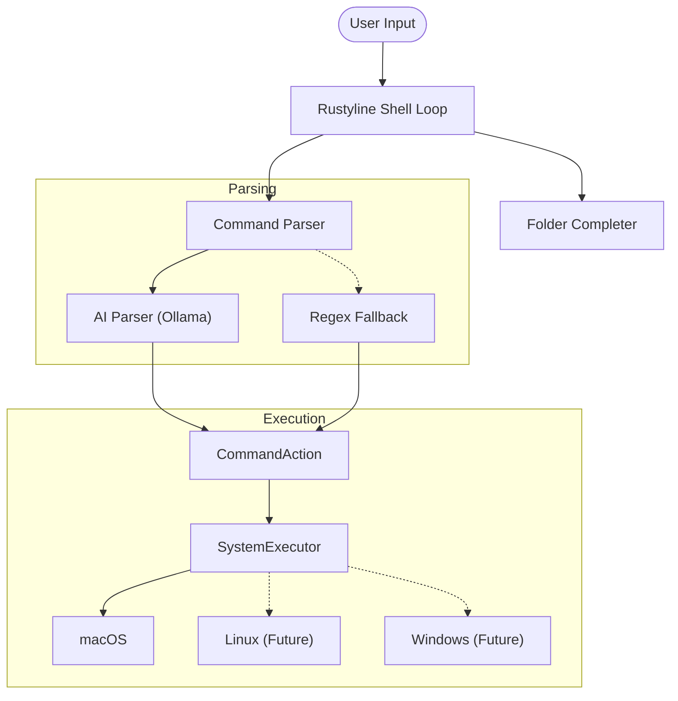

# 🦀 The Rusty Terminal

An interactive, AI-powered system shell written in Rust that translates natural language commands into native system actions. Leveraging a local large language model (LLM) via Ollama, **The Rusty Terminal** bridges the gap between conversational commands and system-level execution while preserving complete user privacy.

---

## 🌟 Features

- **Natural Language Parsing**: Type human-like phrases (e.g., *"open safari"*, *"go to my documents folder"*) and watch them execute.
- **Local-First & Private**: Powered by a local Ollama server running lightweight models like `llama3.2:1b` (zero API costs, zero data tracking).
- **Interactive Shell Features**: Custom tab-completion powered by `rustyline`, supporting tilde (`~`) expansion and common folder autocompletions.
- **Type-Safe Command Execution**: Commands are parsed into structured JSON that maps to a robust, type-safe Rust `CommandAction` enum before run.
- **Persistent History**: Keeps track of shell inputs across sessions in `.rusty_terminal_history`.

---

## 🧭 Philosophy

1. **Intelligent Command Interfaces**: We believe the CLI shouldn't require memorizing complex, platform-specific flags. Shells should understand *intent* and execute safely.
2. **Local-First & Absolute Privacy**: Shell history and commands are highly sensitive. By running lightweight open-weights models locally via Ollama, no data ever leaves your computer.
3. **Rust Robustness**: Safety, concurrency, and performance of Rust ensure that system executions, completion engines, and parsing are fast and crash-resistant.

---

## 🏗️ Architecture

The terminal splits parsing and execution into distinct modules, keeping translation separate from platform-dependent API calls.



### Key Components:
* **[main.rs](file:///Users/madhuryatelang/Coding/Personal%20Projects/the-rusty-terminal/src/main.rs)**: Orchestrates the REPL loop, history tracking, and links the completer, parser, and executor.
* **[actions.rs](file:///Users/madhuryatelang/Coding/Personal%20Projects/the-rusty-terminal/src/actions.rs)**: Defines the `CommandAction` enum, mapping inputs to structured objects like `OpenApp`, `OpenFolder`, `ExecuteSystemCommand`, `Exit`, etc.
* **[parser/](file:///Users/madhuryatelang/Coding/Personal%20Projects/the-rusty-terminal/src/parser)**: Contains traits and implementations for parsing commands:
  * **[ai_parser.rs](file:///Users/madhuryatelang/Coding/Personal%20Projects/the-rusty-terminal/src/parser/ai_parser.rs)**: Calls local Ollama endpoints with structured prompts to convert user text to action JSON.
  * **[regex_parser.rs](file:///Users/madhuryatelang/Coding/Personal%20Projects/the-rusty-terminal/src/parser/regex_parser.rs)**: A fallback regex-based parser that handles basic commands when the LLM is unavailable.
* **[executor/](file:///Users/madhuryatelang/Coding/Personal%20Projects/the-rusty-terminal/src/executor)**: Natively runs the resolved actions:
  * **[macos.rs](file:///Users/madhuryatelang/Coding/Personal%20Projects/the-rusty-terminal/src/executor/macos.rs)**: macOS implementation using the `open` utility and standard child processes.
* **[completer.rs](file:///Users/madhuryatelang/Coding/Personal%20Projects/the-rusty-terminal/src/completer.rs)**: Implements auto-completion for system paths, tildes, and special quick-folders.

---

## 🚀 Getting Started

### Prerequisites

1. **Rust Toolchain**: Make sure Rust is installed.
   ```bash
   curl --proto '=https' --tlsv1.2 -sSf https://sh.rustup.rs | sh
   ```
2. **Ollama**: Download and install [Ollama](https://ollama.com).
3. **Pull the Default Model**:
   ```bash
   ollama run llama3.2:1b
   ```

### Running the Terminal

1. Ensure Ollama is running in the background:
   ```bash
   ollama serve
   ```
2. Clone the repository and navigate inside:
   ```bash
   cd the-rusty-terminal
   ```
3. Run the shell:
   ```bash
   cargo run
   ```

---

## 🔮 Future Scope

* **Automatic Fallback to Regex**: Enable the shell to automatically fall back to the regex parser when Ollama is offline or experiences latency, ensuring the terminal is always functional.
* **Cross-Platform Compatibility**: Implement `SystemExecutor` hooks for **Linux** (using `xdg-open` / specific shells) and **Windows** (using `powershell` / `cmd`).
* **Interactive Tool Executions**: Expand LLM parsing to execute build tools (`cargo build`), search tools (`grep`), or general CLI tools (`git status`) and piping their output back.
* **Configuration Profiles**: Add support for a `.rustyterminalrc` or config file to specify custom system prompts, alternative models, custom aliases, and customizable prompt themes.
* **Contextual Environment Awareness**: Provide the local model with ambient context (e.g., current directory structure, OS variables) to allow conversational statements like *"make a new folder here called tests"* or *"delete the largest file in downloads"*.
